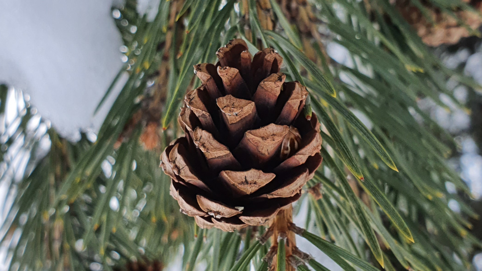

## Présentation

Le moteur Pine a commencé à être développer assez récemment et n'a donc pas encore beaucoup de fonctionnalités. 
Il est pour le moment entièrement développé en C/C++ et utilise la technologie OpenGL pour les graphismes.  
Le but est d'au moins pouvoir créer un jeu en 2D avec le moteur Pine. 
Il faut donc encore pouvoir gérer efficacement les graphismes, l'audio, les physiques et les connections au réseau.
