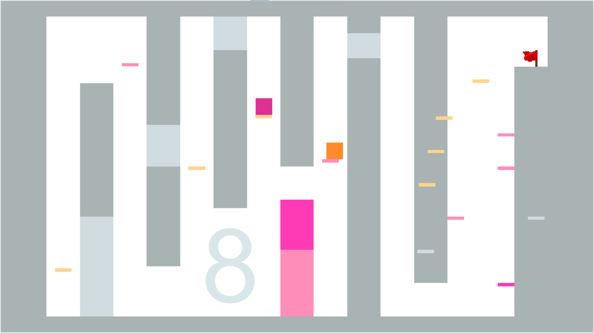

## Présentation

Dans ce jeu, les joueurs incarnent chacun un des 2 carrés. L'un est orange et l'autre violet.
Les carrés peuvent se déplacer et sauter dans un environnement 2D rempli de plateformes.
Le but du jeu est de compléter les différents niveaux en arrivant jusqu'au drapeau. 
Mais pour ce faire, les joueurs devront parfois collaborer. Par exemple ils peuvent se 
positionner l’un sur l'autre afin d’atteindre une plateforme en hauteur.